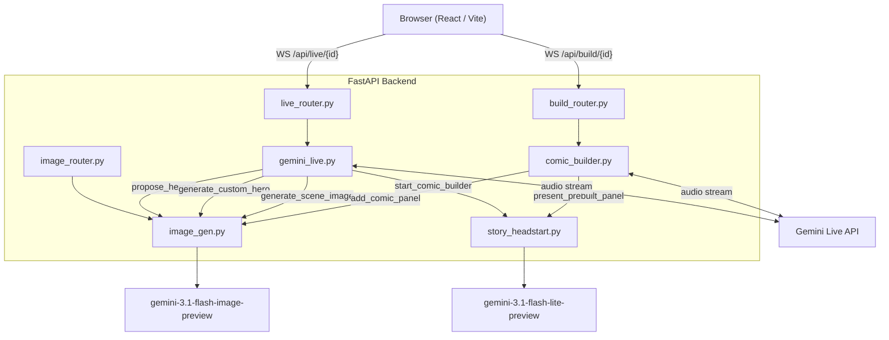
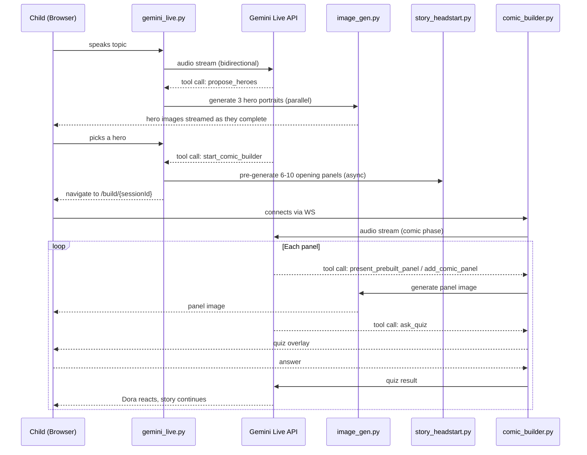

# Questory

An AI-powered interactive learning adventure. Children choose a topic, pick a hero, and experience a personalized comic book story generated in real time by a live AI voice guide. Educational facts are woven into the narrative and tested via embedded quizzes.

Built for the [Gemini Live Agent Challenge](https://geminiliveagentchallenge.devpost.com/?ref_feature=challenge&ref_medium=discover) — **Creative Storyteller** category.

---

## How It Works

1. The child tells Dora (the AI voice guide) what they want to learn — by speaking, typing, pasting a YouTube URL, or uploading a PDF.
2. Dora proposes three heroes based on the topic. Portrait images are generated for each in parallel.
3. The child picks a hero. While the selection happens, the opening comic panels are pre-generated silently in the background.
4. The story begins: Dora narrates panel by panel over real-time audio, AI-generated illustrations appear one by one, and quizzes test what each panel just taught.
5. The child's spoken answers shape what happens next. Completed stories are saved to a personal library.

---

## Architecture



### Session lifecycle



---

## Tech Stack

| Layer | Technology |
|---|---|
| Frontend | React 18, Vite, TypeScript, TailwindCSS |
| 3D voice avatar | Three.js via @react-three/fiber and @react-three/drei, real-time lip-sync |
| Backend | FastAPI, Python 3.11+, asyncio WebSocket proxy |
| Voice AI | gemini-2.5-flash-native-audio-preview-12-2025 (Gemini Live API) |
| Image AI | gemini-3.1-flash-image-preview (Google GenAI SDK) |
| Story pre-generation | gemini-3.1-flash-lite-preview |
| Monorepo | npm workspaces (apps/api, apps/web, packages/shared) |
| Containerization | Docker, deployable to Cloud Run |

---

## Project Structure

```
Questory/
├── apps/
│   ├── api/                          # FastAPI backend
│   │   ├── main.py                   # Entry point, CORS, static file mount
│   │   ├── src/
│   │   │   ├── routers/
│   │   │   │   ├── live_router.py    # WS /api/live/{id}
│   │   │   │   ├── build_router.py   # WS /api/build/{id}, REST library API
│   │   │   │   └── image_router.py   # POST /api/generate-image
│   │   │   └── services/
│   │   │       ├── gemini_live.py         # Story setup agent (Dora)
│   │   │       ├── comic_builder.py       # Comic story agent, panel orchestration
│   │   │       ├── image_gen.py           # Gemini image generation
│   │   │       ├── story_headstart.py     # Async opening panel pre-generation
│   │   │       └── story_session_store.py # Session state (memory + disk)
│   │   └── Dockerfile
│   └── web/                          # React frontend
│       └── src/
│           ├── pages/
│           │   ├── LandingPage.tsx
│           │   ├── CreateStoryPage.tsx    # Voice setup, hero selection
│           │   ├── StoryBuilderPage.tsx   # Live comic reader + quizzes
│           │   ├── StoryViewerPage.tsx    # Completed story viewer
│           │   └── LibraryPage.tsx        # Story library
│           └── hooks/
│               └── useGeminiLive.ts       # WebSocket audio hook
└── packages/
    └── shared/                       # Shared TypeScript types
```

---

## Getting Started

### Prerequisites

- Node.js 20+ and npm 10+
- Python 3.11+
- Gemini API key from [Google AI Studio](https://aistudio.google.com/)

### 1. Install dependencies

```bash
# From the repo root — installs web and api npm packages
npm install
```

```bash
# Python dependencies
cd apps/api
python -m venv venv
source venv/bin/activate      # Windows: venv\Scripts\activate
pip install -r requirements.txt
```

### 2. Configure environment

Create `apps/api/.env`:

```env
GEMINI_API_KEY=your_api_key_here
```

### 3. Run in development

Run both servers from the repo root:

```bash
npm run dev
```

Or run them separately:

```bash
# Backend — http://localhost:8000
cd apps/api
source venv/bin/activate
uvicorn main:app --reload --port 8000

# Frontend — http://localhost:5173
cd apps/web
npm run dev
```

Open [http://localhost:5173](http://localhost:5173).

### Docker (backend only)

```bash
cd apps/api
docker build -t questory-api .
docker run -p 8000:8000 -e GEMINI_API_KEY=your_key questory-api
```

---

## License

MIT — see [LICENSE](LICENSE).
